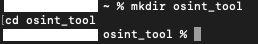
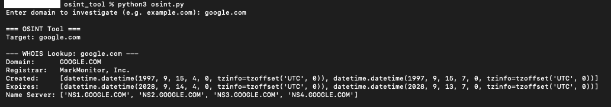
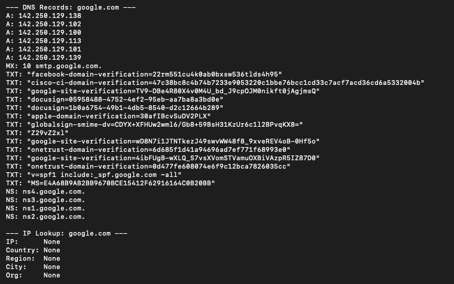
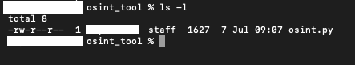

# Open Source Intelligence Tool (OSINT) Using Python


---

## Objective

Build a Python script that is able gather publicly available information about a target domain including:

- WHOIS registration data
- DNS records
- IP geolocation and organisation data

---

## Tools & Language

- **Language:** Python 3
- **Libraries:** `python-whois`, `dnspython`, `requests`
- **Environment:** Mac Terminal
- **Files:** `osint.py`

---

## Code

```python
import whois
import dns.resolver
import requests

def whois_lookup(domain):
    print(f"\n--- WHOIS Lookup: {domain} ---")
    try:
        w = whois.whois(domain)
        print(f"Domain:      {w.domain_name}")
        print(f"Registrar:   {w.registrar}")
        print(f"Created:     {w.creation_date}")
        print(f"Expires:     {w.expiration_date}")
        print(f"Name Server: {w.name_servers}")
    except Exception as e:
        print(f"[ERROR] WHOIS lookup failed: {e}")

def dns_lookup(domain):
    print(f"\n--- DNS Records: {domain} ---")
    record_types = ["A", "MX", "TXT", "NS"]
    for record in record_types:
        try:
            answers = dns.resolver.resolve(domain, record)
            for answer in answers:
                print(f"{record}: {answer}")
        except Exception:
            print(f"{record}: No record found")

def ip_lookup(domain):
    print(f"\n--- IP Lookup: {domain} ---")
    try:
        response = requests.get(f"https://ipapi.co/{domain}/json/")
        data = response.json()
        print(f"IP:      {data.get('ip')}")
        print(f"Country: {data.get('country_name')}")
        print(f"Region:  {data.get('region')}")
        print(f"City:    {data.get('city')}")
        print(f"Org:     {data.get('org')}")
    except Exception as e:
        print(f"[ERROR] IP lookup failed: {e}")

def run_osint(domain):
    print(f"\n=== OSINT Tool ===")
    print(f"Target: {domain}")
    whois_lookup(domain)
    dns_lookup(domain)
    ip_lookup(domain)
    print(f"\n=== Scan Complete ===")

domain = input("Enter domain to investigate (e.g. example.com): ")
run_osint(domain)
```

---

## Explanation

**What is OSINT?**

OSINT (Open Source Intelligence Tool) , is the practice of collating information from publicly available sources. Within a SOC environment, OSINT is used during alert triage and threat investigation to gather contextual data about suspicious domains, IP addresses and infrastructure. Being able to understand who owns a domain, where it resolves to and when it was registered can be the difference between identifying a legitimate service and a malicious one.

**WHOIS Lookup**

WHOIS is a publicly accessible database that stores the registration information of every domain on the internet. The script queries this database to retrieve the registrar, creation date, expiration date and name servers associated with a domain.

**DNS Records**

The script queries four DNS record types for the target domain. A records map the domain to its IPv4 address. MX records identify the mail servers responsible for handling email for the domain. TXT records often contain SPF and DMARC email security policies. NS records identify the authoritative name servers for the domain. Analysing these records helps build a picture of a domain's infrastructure and can surface anomalies that indicate malicious activity.

**IP Geolocation**

The script uses the ipapi.co API to retrieve geolocation and organisation data for the domain's IP address. Knowing where a domain's infrastructure is hosted and who owns the hosting organisation can be useful during an investigation especially when investigating suspicious outbound connections.

**Why google.com Was Used for Testing**

google.com is a well known, publicly available domain with rich WHOIS and DNS data, making it ideal for demonstrating all three tools in a single scan. No systems were targeted without permission - all data retrieved is publicly available information.

---

## Screenshots

| # | Screenshot | Description |
|---|---|---|
| 1 |  | Project folder created |
| 2 |  | Libraries installed |
| 3 |  | Nano editor with code visible |
| 4 |  | WHOIS output |
| 5 |  | DNS records and IP lookup output |
| 6 |  | File listing showing osint.py |

---

## Improvement Ideas

- **Add subdomain enumeration** - Extend the script to discover subdomains associated with the target domain using a wordlist
- **Integrate threat intelligence feeds** - Cross reference the domain or IP against public threat intelligence sources like VirusTotal or AbuseIPDB
- **Export results to a report** - Write all findings to a timestamped text or JSON file for documentation purposes
- **Add SSL certificate analysis** - Retrieve and inspect the SSL certificate for the domain to check issuer, expiry and validity

---

## Notes

- All data retrieved by this tool is publicly available information
- This tool was tested against google.com - a publicly accessible domain used for demonstration purposes only
- This project is for educational purposes to understand OSINT techniques used in security investigations
- All screenshots have been reviewed to remove personal identifying information
